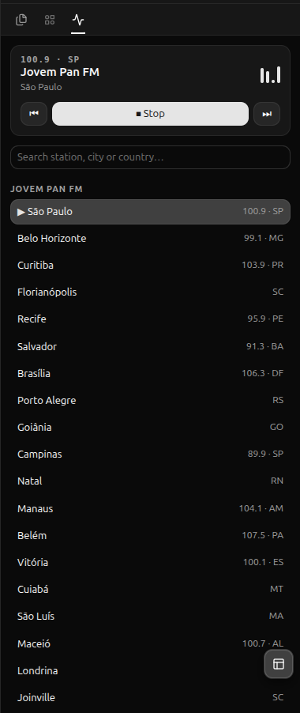

# Radio FM for Orca



A radio panel for the [Orca](https://github.com/stablyai/orca) IDE. Click a station in the right
sidebar and it plays; ⏮ ⏹ ⏭ do what you'd expect.

It ships with **45 Brazilian stations**, including **Jovem Pan FM in 23 cities** (São Paulo, Belo
Horizonte, Curitiba, Florianópolis, Recife, Salvador, Brasília, Porto Alegre, Goiânia, Campinas,
Natal, Manaus, Belém, Vitória, Cuiabá, São Luís, Maceió, Londrina, Joinville, Santos, Ribeirão
Preto, Uberlândia, Sorocaba), plus Jovem Pan News, Band FM, Mix FM, Antena 1, Transamérica, Alpha
FM, Kiss FM, 89 FM, Nativa, Energia 97, Massa FM, Metropolitana, Rádio Globo, CBN and BandNews FM.

**Radios from any country can be added**: each country is one JSON file in [`stations/`](stations).
See [Adding stations](#adding-stations).

> Orca's plugin API is experimental (`pluginApi: 1`). This plugin was built against Orca 1.4.x.

<br clear="right">

## Requirements

- Orca ≥ 1.4.0 with plugins enabled
- An audio player on `PATH`: [mpv](https://mpv.io), `ffplay` (part of [FFmpeg](https://ffmpeg.org)) or `cvlc` ([VLC](https://www.videolan.org)). They are tried in that order.
- For the **panel buttons**: Linux with systemd and a desktop notification service (GNOME, KDE, …), plus Node.js ≥ 20 and `dbus-monitor`
- For **volume control**: PipeWire with `wpctl` and `pw-dump`, the default audio stack on current Ubuntu, Fedora and Arch
- Command palette and shortcuts work without the daemon, on Linux and macOS

## Install

```sh
git clone https://github.com/jrmatos/orca-radio-fm.git
cd orca-radio-fm
./daemon/install.sh        # Linux: enables the panel buttons (see "How it works")
```

Then in Orca:

1. **Settings → Plugins → Development → Add path** and enter the full path of the cloned folder.
   (Alternatively, **Install plugin → Git URL** with `https://github.com/jrmatos/orca-radio-fm#v1.1.0`.
   That gives you the palette and shortcuts. The daemon still needs a clone.)
2. Review the permissions (notifications, plugin storage) and click **Enable plugin**.
3. Open the **Radio FM** tab in the right sidebar. Its icon is a waveform; if the sidebar is
   narrow, look under the `…` overflow menu.

## Usage

| How | What |
| --- | --- |
| Panel | Click a station to play it. ⏮ / ▶ ⏹ / ⏭ control playback, and the slider sets the radio's own volume. The search box filters by name, city or country. |
| Command palette | Search `Radio:` to get one command per station, plus Play / Stop, Next and Previous. |
| `Ctrl+Alt+Shift+P` | Play / stop (resumes the last station) |
| `Ctrl+Alt+Shift+N` / `B` | Next / previous station |
| Volume | The panel slider, or the `Radio: Volume up` / `Radio: Volume down` palette commands (±10%) |
| Emergency stop | `pkill -f orca-radio-fm-player` |

The panel text is in Portuguese on pt-* systems and in English everywhere else.

## How it works

Orca renders plugin panels in a sandboxed iframe with a CSP that blocks **all** network and
media, and panels cannot call the plugin's background worker. So audio never plays inside Orca:

- **Panel buttons** use the one panel action that reaches outside Orca: `notifications.show`.
  Orca turns it into a desktop notification (`jrmatos.radio-fm: ▶ <station>`), which travels over
  D-Bus. [`daemon/radio-daemon.mjs`](daemon/radio-daemon.mjs) is a systemd user service named
  `orca-radio-fm`. It watches those D-Bus calls and starts the player, so each click also shows a
  small notification.
- **Palette commands and shortcuts** run in the plugin worker ([`worker.mjs`](worker.mjs)),
  which starts the player directly.

Both start the player detached and tag it `orca-radio-fm-player`
([`player.mjs`](player.mjs)), so either path can stop what the other started, and music keeps
playing when Orca recycles its idle worker.

**Volume only affects the radio.** The player's audio stream is named `Orca Radio`, and the slider
changes that stream's PipeWire volume (`wpctl set-volume <node>`). Your system volume and other
apps are never touched. The level is saved in `~/.local/state/orca-radio-fm/state.json` and
applied to every new station. The panel can't read the saved level back, so after the panel
reloads, the slider shows the real level only once you move it.

Daemon logs: `journalctl --user -u orca-radio-fm -f`. Uninstall:

```sh
systemctl --user disable --now orca-radio-fm && rm ~/.config/systemd/user/orca-radio-fm.service
```

## Adding stations

Short version: edit or create `stations/<country-code>.json`, then run `npm run build`,
`npm run check -- <country-code>`, and open a PR. Full guide: [CONTRIBUTING.md](CONTRIBUTING.md).

```jsonc
// stations/us.json
{
  "country": "US",
  "countryName": "United States",
  "stations": [
    {
      "id": "kexp-seattle",           // unique, kebab-case
      "name": "KEXP",
      "city": "Seattle",              // optional
      "state": "WA",                  // optional
      "frequency": "90.3",            // optional
      "group": "Music",               // optional section heading (default "Radio")
      "url": "https://kexp.streamguys1.com/kexp160.aac"
    }
  ]
}
```

`npm run find -- "station name" --country US` searches the community
[Radio Browser](https://www.radio-browser.info) directory and prints entries in this format.

> **Note for local development:** the plugin defines keyboard shortcuts, so Orca ties your
> approval to the folder's exact contents. After any change, re-approve the plugin in
> **Settings → Plugins**. The daemon needs no restart: it re-reads `stations/` on every click.

## Credits

Stream URLs come from the stations' official players (Jovem Pan affiliates are listed at
jovempan.com.br/afiliada) and the [Radio Browser](https://www.radio-browser.info) community
directory. All streams belong to their broadcasters. This project only links to their public
streams.

## License

[MIT](LICENSE) © Paulo Matos
